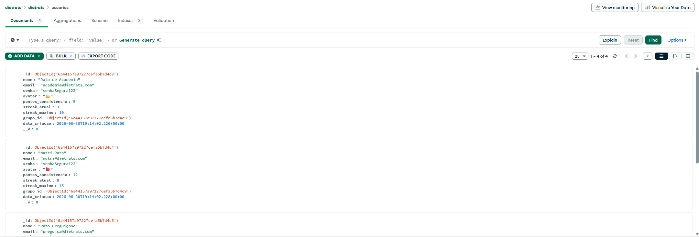
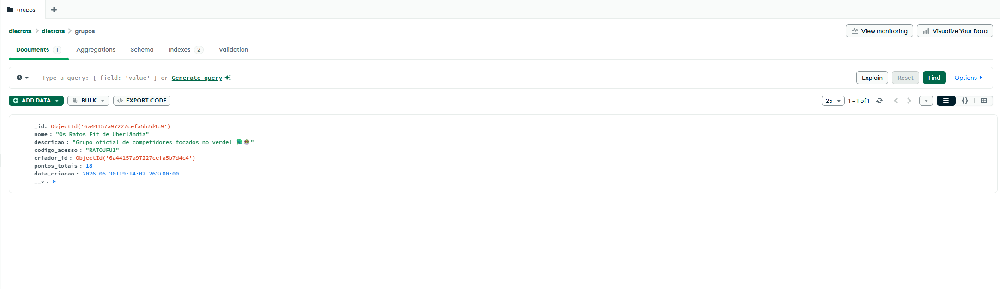
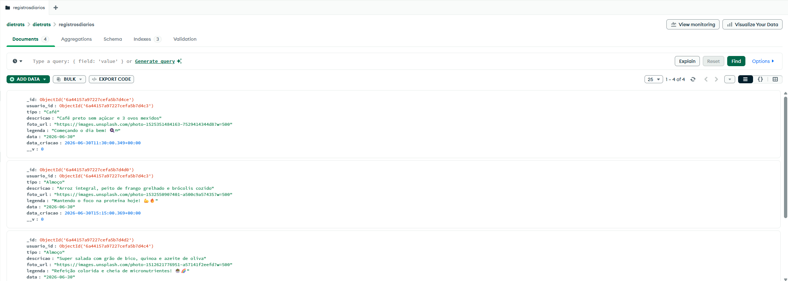
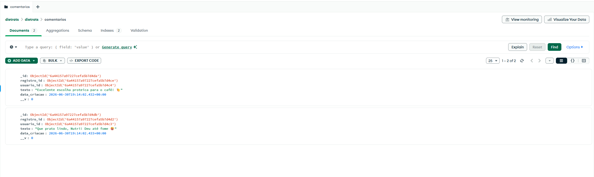
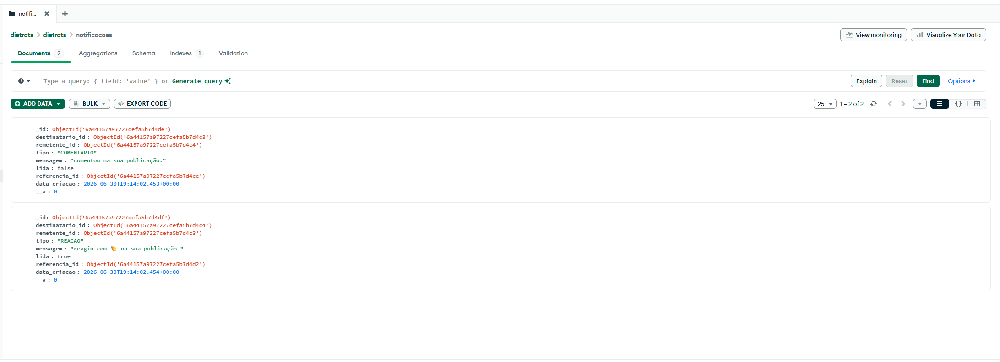

# Banco de Dados - DietRats

## Sobre

O DietRats utiliza o **MongoDB** como banco de dados não relacional para armazenar as informações do aplicativo. A modelagem foi desenvolvida seguindo os princípios de bancos orientados a documentos, buscando flexibilidade, simplicidade e facilidade de escalabilidade.
Diferentemente de um aplicativo de contagem de calorias, o DietRats funciona como uma **rede social de registro de conquistas da dieta**. Os usuários registram apenas refeições em que conseguiram seguir seu plano alimentar, acumulando pontos de consistência e participando de rankings em grupos de amigos.

# Estrutura do Banco
O banco de dados possui as seguintes coleções:

- usuarios
- grupos
- registrosdiarios
- comentarios
- reacoes
- notificacoes

# Coleção: usuarios

Responsável por armazenar as informações de cada usuário cadastrado.

### Principais campos

| Campo | Descrição |
|--------|-----------|
| _id | Identificador único do usuário |
| nome | Nome do usuário |
| email | Endereço de e-mail |
| senha | Senha do usuário |
| avatar | Emoji ou imagem de perfil |
| pontos_consistencia | Pontuação obtida pelas refeições saudáveis registradas |
| streak_atual | Quantidade de dias consecutivos registrando refeições |
| streak_maximo | Maior sequência já alcançada |
| grupo_id | Grupo ao qual o usuário pertence |
| data_criacao | Data de criação da conta |

---

# Coleção: grupos

Armazena os grupos criados pelos usuários para participação em rankings e desafios.

### Principais campos

- nome
- descricao
- codigo_convite
- administrador
- participantes
- data_criacao

---

---

# Coleção: registrosdiarios

Representa cada conquista registrada pelo usuário.

Cada documento corresponde a uma refeição considerada saudável.

### Principais campos

- usuario_id
- grupo_id
- tipo_refeicao
- descricao
- foto
- pontos
- data_registro

Essa coleção é a principal do sistema, pois registra as conquistas que alimentam o ranking.

---

---

# Coleção: comentarios

Permite que usuários interajam com os registros publicados.

### Principais campos

- usuario_id
- registro_id
- comentario
- data

---

---

# Coleção: reacoes

Armazena as reações realizadas em cada publicação.

As reações funcionam como incentivo entre os participantes.

### Principais campos

- usuario_id
- registro_id
- emoji
- data

---

---

# Coleção: notificacoes

Responsável pelo envio de notificações aos usuários.

Exemplos:

- novo comentário;
- nova reação;
- usuário entrou no grupo;
- conquista registrada.

### Principais campos

- usuario_destino
- tipo
- mensagem
- lida
- data

---
*

---

# Relacionamento entre as coleções

Embora o MongoDB seja um banco de dados não relacional, as coleções possuem referências entre si por meio dos identificadores (`ObjectId`).

Os principais relacionamentos são:

- Um usuário pode pertencer a um grupo.
- Um usuário pode criar diversos registros diários.
- Um registro diário pode receber várias reações.
- Um registro diário pode receber vários comentários.
- As notificações são direcionadas a um usuário específico.

---

# Justificativa da modelagem

A utilização do MongoDB permitiu armazenar documentos com estrutura flexível, facilitando futuras alterações no sistema sem a necessidade de migrações complexas.

A separação em seis coleções melhora a organização dos dados e reduz a duplicação de informações, mantendo um modelo consistente e de fácil manutenção.

Além disso, a utilização de referências (`ObjectId`) entre documentos possibilita representar os relacionamentos necessários entre usuários, grupos, registros e interações sociais de forma eficiente.

---

# Tecnologias utilizadas

- MongoDB Atlas
- Banco de dados NoSQL
